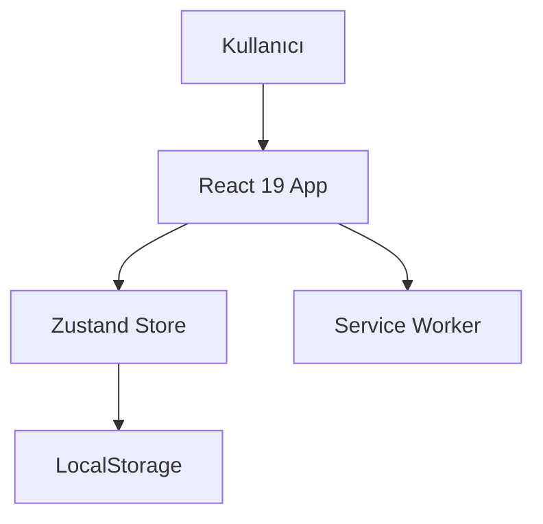

# Sistem Mimarisi ve Desenler

## Mimari Genel Bakış

SubTracker, istemci taraflı (Client-Side) çalışan, sunucusuz (Serverless) bir Single Page Application (SPA)'dır.



## Dosya Yapısı (Feature-Based)

```
src/
  components/
    features/         # İş mantığı bileşenleri
      subscription/   # Abonelik modülü
      analytics/      # Analitik modülü
    ui/              # Shadcn/UI (Atomik bileşenler)
    forms/           # Form elemanları (CategorySelect vb.)
    layout/          # Sayfa düzenleri
  stores/            # Zustand state yönetimi
  types/             # TypeScript tanımları
  lib/               # Yardımcı kütüphaneler (utils)
```

## Kodlama Standartları

1. **TypeScript:** Strict mode açık. `any` kullanımı yasak (test mock'ları hariç ESLint ile engelli).
2. **Component API:** Props interface'leri her zaman export edilir.
3. **Store:** Slice pattern kullanılır. Selector pattern ile re-render optimizasyonu yapılır.
4. **Testing:**
   - **Unit:** Vitest + React Testing Library. Component logic ve render testleri.
   - **E2E:** Playwright (İleride eklenecek).
5. **Styling:** Tailwind CSS + CSS Variables (Theme desteği için).

## Kritik Desenler

- **Selector Pattern:** Store'dan veri çekerken her zaman `useStore(state => state.value)` şeklinde selector kullanılır.
- **Fail-Safe Data:** `localStorage` hatalarına karşı (QuotaExceeded) try-catch blokları ve kullanıcı uyarıları mevcuttur.
- **Mobile-First:** Tüm bileşenler önce mobil (`<768px`) için tasarlanır, sonra desktop (`md:`) için genişletilir. Touch target'lar min 44px (Tercihen 48px+).
