# UX Design Specification - SubTracker

**Author:** kolsag
**Date:** 2025-12-16

---

## Executive Summary

### Project Vision

SubTracker, kişisel abonelik takip dashboard'u — ama gerçek değeri app içinde değil, **proaktif bildirimlerinde** yatar.

**Core Truth:** Uygulama nadiren açılacak — değer dışarıda olmalı.

**Positioning:** "Uygulamayı açmana gerek yok. SubTracker seni bulur." — Anti-app yaklaşımı.

**Aha Moment:** Uygulama açılmadan gelen notification ile ödeme farkındalığı.

### Target Users

**Primary Persona: Emre**

- **Yaş:** 25 | **Meslek:** Jr. Software Developer | **Gelir:** 40-45K TRY/ay
- **Tech-savviness:** Orta-Yüksek (developer ama abonelik takibi için özel çaba harcamıyor)
- **Abonelik profili:** 8-10 abonelik (5-6'sını biliyor, 2-3'ü "zombie")
- **Pain:** Ay sonu ekstre şoku, yıllık yenilemeleri unutma, USD kur sürprizleri

**Trigger Event:** Tanımadığı kesinti gördüğünde "Bu ne?" şoku.

**Success Vision:** "Ödeme olmadan ÖNCE bilmek" + "Kullanmadığım şeyi fark edip iptal edebilmek"

### Key Design Challenges

1. **Notification-First UX** — Değer uygulama dışında teslim edilmeli
2. **iOS PWA Barrier** — Notification için PWA kurulumu zorunlu, onboarding'de çözmeli
3. **Minimal Data Entry** — Abonelik ekleme <30 saniye, friction'sız
4. **Countdown Crescendo** — 24 saat = dramatik, öncesi = subtle
5. **Non-Intrusive Audit** — Zombie keşfi soru bazlı ama rahatsız edici değil
6. **Onboarding Paradoksu** — "Açmayın" diyoruz ama first-run kritik (Party Mode insight)

### Design Opportunities

1. **First Value in Setup** — Setup sırasında "zombie keşfi" şoku yaratmak
2. **Card-Based Mental Model** — Gerçek kredi kartları = abonelik grupları
3. **Savings Celebration** — İptal = kurtarılan para, gamification potansiyeli
4. **Anti-App Positioning** — "Bizi açma" messaging = pazarlama avantajı
5. **FX Shock Alert** — Kur değişim uyarısı = unique differentiator
6. **Quick-Add List** — Popüler abonelikler (Netflix, Spotify, iCloud) tek tıkla ekle (Party Mode insight)

### Party Mode Insights (Step 2)

| Agent            | Key Insight                                             | UX Implication                                    |
| ---------------- | ------------------------------------------------------- | ------------------------------------------------- |
| **Sally (UX)**   | Onboarding paradoksu — "açmayın" ama ilk run çok kritik | Quick-add list + Countdown Hero = immediate value |
| **John (PM)**    | TTFV <5 min, değer setup SIRASINda teslim edilmeli      | First zombie discovery > First notification       |
| **Amelia (Dev)** | iOS PWA detection zorunlu, FX API 24h cache             | Onboarding'de platform-aware flow                 |
| **Sally (UX)**   | Crescendo 4 tier: subtle → colored → pulsing → urgent   | 24 saat eşiği UX milestone                        |

### Countdown Crescendo Design Specification

| Zaman Aralığı | Görsel Stil                      | Davranış                |
| ------------- | -------------------------------- | ----------------------- |
| 7+ gün        | Subtle, text-only                | Minimal dikkat çekme    |
| 3-7 gün       | Colored badge                    | Hafif vurgu             |
| 24 saat       | Pulsing animation + warning icon | Attention grab          |
| <1 saat       | URGENT mode                      | Tam dramatik, red alert |

### Technical Validations (Party Mode)

- **iOS Detection:** `window.matchMedia('(display-mode: standalone)')` + user-agent check
- **FX API:** exchangerate-api.com veya openexchangerates.org, 24h cache
- **localStorage:** ~5MB limit, 500+ abonelik ~2-3KB — sorun yok
- **Countdown Animation:** CSS animation + requestAnimationFrame

---

## Core User Experience

### Defining Experience

**Anti-App Paradigm:** SubTracker'ın core experience'ı paradoksal — en iyi deneyim, uygulamayı **açmamak**tır.

**Primary Value Delivery:** Browser notification ile ödeme öncesi farkındalık. Uygulama içi değil, uygulama dışı değer.

**When App Opens:** Dashboard tek bakışta tüm resmi göstermeli:

- Countdown Hero (en yakın ödeme)
- Aylık toplam
- Yaklaşan ödemeler timeline
- Kart bazlı gruplama

### Platform Strategy

| Platform               | Priority | Implementation               |
| ---------------------- | -------- | ---------------------------- |
| **Web (Mobile-First)** | Primary  | React SPA, responsive design |
| **PWA**                | Required | Manifest + Service Worker    |
| **Desktop**            | Enhanced | Grid layout, hover states    |
| **Offline**            | Core     | localStorage + cache-first   |

**iOS Constraint:** Notification için PWA kurulumu zorunlu. Onboarding'de detection + guidance.

**Tech Stack:** React 18 + Vite + TailwindCSS v4 + shadcn/ui + localStorage

### Effortless Interactions

| Interaction             | Target    | How                           |
| ----------------------- | --------- | ----------------------------- |
| **Add subscription**    | <30 sec   | Quick-add list + minimal form |
| **View total**          | 0 clicks  | Hero widget always visible    |
| **Notification action** | 1 tap     | Direct action buttons         |
| **Card grouping**       | Automatic | Select card, auto-group       |
| **Dark mode**           | Automatic | System preference follow      |

**Zero Friction Principles:**

- No login required (localStorage only)
- No account creation
- No email verification
- No payment wall

### Critical Success Moments

| Moment                | Trigger                    | UX Goal                          |
| --------------------- | -------------------------- | -------------------------------- |
| **First Value**       | First sub + total shown    | "Gerçeği gördüm" awareness       |
| **Control Feeling**   | Countdown Hero appears     | "Artık hazırlıklıyım" confidence |
| **Trust Established** | First notification arrives | "Sistem çalışıyor" trust         |
| **Money Saved**       | Zombie discovered          | "Para kurtardım" celebration     |
| **FX Awareness**      | Currency alert shown       | "Kur riski görüyorum" informed   |

### Empty State & Onboarding (Party Mode)

**Empty State Strategy:** Hybrid onboarding approach

1. **Welcome Message:** "Merhaba! Aboneliklerini ekleyerek başlayalım"
2. **Quick-Add Grid:** Popular services (Netflix, Spotify, iCloud, Adobe, ChatGPT, GitHub)
3. **Custom Entry:** "+Diğer" butonu ile manuel ekleme
4. **Minimal Form:** Sadece gerekli alanlar (platform, fiyat, tarih, kart)

**Just-in-Time Permission Flow:**

1. User adds first subscription
2. UI shows: "Netflix için ödeme hatırlatıcısı kurulsun mu?"
3. User clicks "Evet"
4. Browser permission request triggered
5. Context = higher acceptance rate

**iOS Detection Flow:**

1. Detect iOS Safari (not standalone)
2. Show: "Bildirimler için Ana Ekrana Ekle" guidance
3. Provide step-by-step visual instructions
4. Re-check on next visit

### Graceful Degradation (Party Mode)

| Failure Scenario          | Fallback UX                                                          |
| ------------------------- | -------------------------------------------------------------------- |
| **Notification denied**   | Dashboard'da "Bildirimler kapalı" banner + in-app countdown emphasis |
| **iOS without PWA**       | Persistent "Ana Ekrana Ekle" prompt with instructions                |
| **FX API failed**         | "Kur bilgisi alınamadı" badge, last known rate in italic             |
| **localStorage full**     | Export prompt + cleanup suggestion                                   |
| **Service Worker failed** | Standard web app fallback, no offline                                |

### Data Portability (Party Mode)

**Export/Import as Core Feature:**

- One-click JSON export
- Drag-drop import
- Schema validation on import
- Backup reminder every 7 days (soft prompt)

**User Owns Their Data:**

- No server storage
- No account required
- Full data portability
- Privacy by design

### Experience Principles

1. **Push Before Pull** — Değer bildirimle gelir, uygulama açmayı gerektirmez
2. **Instant Awareness** — Tek bakışta toplam resim görülmeli
3. **Zero Friction Entry** — Login yok, hesap yok, 30 saniyede başla
4. **Proactive Not Reactive** — Ödeme olduktan sonra değil, ÖNCE bildir
5. **Dramatic When It Matters** — 24 saat eşiğinde crescendo, öncesi subtle
6. **Privacy by Default** — Tüm veri cihazda, sunucuya gönderilmiyor
7. **Graceful Degradation** — Notification denied, API failed durumlarında deneyim devam etmeli (Party Mode)
8. **Just-in-Time Permissions** — İzinleri context içinde iste, önceden değil (Party Mode)
9. **Data Portability** — Export/Import ile kullanıcı verisinin sahibi kullanıcı (Party Mode)

### Party Mode Insights (Step 3)

| Agent           | Key Insight                           | UX Implication                   |
| --------------- | ------------------------------------- | -------------------------------- |
| **Sally (UX)**  | Empty state kritik, hybrid onboarding | Guided + quick-add approach      |
| **Barry (Dev)** | Just-in-time permission pattern       | Context-aware permission request |
| **Murat (TEA)** | Graceful degradation eksik            | Fallback UX matrix tanımlandı    |
| **Sally (UX)**  | Failure state tasarımları             | 5 failure scenario + fallback    |
| **Barry (Dev)** | Data portability vurgusu              | 7-day backup reminder            |

---

## Desired Emotional Response

### Primary Emotional Goals

| #   | Duygu           | Açıklama                            | UX Trigger                          |
| --- | --------------- | ----------------------------------- | ----------------------------------- |
| 1   | **Kontrol**     | "Artık biliyorum. Beni şaşırtamaz." | Countdown Hero + Total widget       |
| 2   | **Rahatlama**   | Ekstre şoku yerine proaktif bilgi   | Notification arrives before payment |
| 3   | **Zafer**       | "Bu app bana 4 bin lira kazandırdı" | Zombie iptal edildi, savings shown  |
| 4   | **Güven**       | "Sistem çalışıyor, korunuyorum"     | First notification delivered        |
| 5   | **Farkındalık** | "Oha, bunlara da mı ödüyormuşum?"   | Setup keşif şoku                    |

**Anti-App Emotional Truth:** En iyi duygu, uygulamayı açmadan yaşanan dinginlik — "Biliyorum ki biri beni izliyor ve gerekirse uyaracak."

### Emotional Journey Mapping

| Stage                | Hedef Duygu             | UX Approach                          |
| -------------------- | ----------------------- | ------------------------------------ |
| **Discovery**        | Merak + Umut            | Clean landing, clear value prop      |
| **Onboarding**       | Şaşkınlık + Farkındalık | Total reveal moment, quick-add       |
| **First Value**      | Kontrol + Güç           | Countdown Hero appears               |
| **Daily Use**        | Huzur + Güven           | No app needed, notifications work    |
| **Notification**     | Uyarı + Yetki           | Action buttons, decision empowerment |
| **Zombie Discovery** | Zafer + Kazanç          | Celebration micro-animation          |

### Micro-Emotions to Cultivate

#### Positive (Hedef)

- **Güven** → "Sistem beni koruyacak, notification gelecek"
- **Kontrol** → "Ne ödüyorum, ne zaman ödüyorum — biliyorum"
- **Haz** → "Para kurtardım, akıllıca hareket ettim"
- **Güç** → "Kart bazlı kontrol elimde"
- **Dinginlik** → "Uygulama açmam gerekmiyor, huzurluyum"

#### Negative (Kaçınılacak)

- ❌ **Şüphe** → Notification test butonu göster
- ❌ **Kaos** → Minimal dashboard, clear hierarchy
- ❌ **Suçluluk** → Neutral tone, no judgment on spending
- ❌ **Çaresizlik** → Clear action buttons, iptal linki
- ❌ **Endişe** → "Son sync: X dakika önce" gösterme, trust by default

### Design Implications

| Duygu           | UX Tasarım Kararı                                    |
| --------------- | ---------------------------------------------------- |
| **Kontrol**     | Hero widget always visible, no scroll to see total   |
| **Rahatlama**   | Calm color palette, no aggressive reds except urgent |
| **Zafer**       | Confetti/pulse animation on zombie cancel            |
| **Güven**       | "Bildirimler aktif ✓" badge, notification test       |
| **Farkındalık** | Setup'ta dramatic total reveal                       |
| **Dinginlik**   | No daily engagement prompts, no gamification badges  |

### Emotional Design Principles

1. **Quiet Confidence** — Uygulama sessiz ama güçlü bir koruma hissi vermeli
2. **Drama Where It Matters** — 24 saat eşiğinde crescendo, öncesi subtle
3. **Celebrate Savings** — Her iptal bir zafer, görsel olarak kutla
4. **No Guilt, No FOMO** — Nötr ton, spending shame yok, "kaçırıyorsun" mesajı yok
5. **Trust Through Transparency** — Notification log, last sync time, system status
6. **Empowerment Not Dependency** — Kullanıcı karar verir, app sadece bilgilendirir

### Emotional Anti-Patterns (Avoid)

| Anti-Pattern                 | Neden              | Alternatif                     |
| ---------------------------- | ------------------ | ------------------------------ |
| "X TL harcadın!"             | Suçluluk yaratır   | "Toplam: X TL/ay" nötr         |
| "3 gün önce kontrol etmedin" | FOMO tetikler      | Sadece ödeme yaklaşınca bildir |
| "Premium'a geç!"             | Güven kırar        | MVP'de monetization yok        |
| "Arkadaşlarını davet et"     | Spam hissi         | Organik paylaşım, zorla değil  |
| "Streak: 5 gün!"             | Dependency yaratır | Anti-app = az giriş iyi        |

---

## UX Pattern Analysis & Inspiration

### Inspiring Products Analysis

#### 1. Cleo (AI Finance Assistant)

- **Proactive Alerts:** Harcama pattern'leri hakkında push notification
- **Conversational UI:** Friendly, casual tone — "Hey, Netflix charged you"
- **Micro-celebrations:** Para tasarrufu yapınca kutlama animasyonu
- **Lesson:** Friendly notification tone + savings celebration

#### 2. Due (Reminders App)

- **Persistent Reminders:** Snooze until done — notification'lar kaçmaz
- **Minimal UI:** Tek ekran, no navigation complexity
- **Quick Add:** Natural language, friction-free
- **Lesson:** Minimal single-screen focus + persistent notification pattern

#### 3. YNAB (You Need A Budget)

- **Age of Money:** Dramatik hero metric
- **Category Bubbles:** Visual spending representation
- **Data Ownership:** Export capabilities, user owns data
- **Lesson:** Dramatic Countdown Hero + data export emphasis

#### 4. Todoist

- **Quick Add:** Natural language parsing, minimal fields
- **Date Chips:** Visual due date indicators
- **Cross-platform:** PWA + native seamless
- **Lesson:** Quick-add pattern + visual date chips

#### 5. Headspace

- **Calm Aesthetics:** Soft colors, breathing room
- **Quiet Notifications:** Non-intrusive, gentle
- **Progress without pressure:** No streak shaming
- **Lesson:** Calm aesthetics + no-pressure tone

### Transferable UX Patterns

#### Navigation

1. **Single Screen Dashboard** — Tüm bilgi tek ekranda (Due, Cleo)
2. **Card Tabs** — Kart bazlı gruplama için switching (YNAB)
3. **Floating Action Button** — Quick-add trigger (Material)

#### Interaction

1. **Quick Add** — Popüler abonelikler + minimal form (Todoist)
2. **Pull to Refresh** — Manuel data refresh (Universal)
3. **Long Press Context** — Card context menu (iOS)

#### Visual

1. **Hero Metric** — Countdown Hero widget (YNAB Age of Money)
2. **Calm Color Palette** — Soft gradients (Headspace)
3. **Date Chips** — Color-coded countdown badges (Todoist)
4. **Micro-animations** — Savings celebration (Cleo)

### Anti-Patterns to Avoid

| Anti-Pattern             | Why Avoid          | Alternative                        |
| ------------------------ | ------------------ | ---------------------------------- |
| **Aggressive Upsell**    | Güven kırar        | MVP free, no premium prompts       |
| **Streak Pressure**      | Dependency yaratır | Anti-app = less engagement is good |
| **Complex Navigation**   | Confusion          | Single screen dashboard            |
| **Information Overload** | Overwhelm          | Minimal metrics, hero focus        |
| **Social Comparison**    | Negative emotions  | Privacy-first, no social           |

### Design Inspiration Strategy

#### What to Adopt

- **Countdown Hero** — YNAB's Age of Money dramatic metric style
- **Quick-Add Grid** — Todoist's minimal friction add flow
- **Calm Aesthetics** — Headspace's soft, breathing design
- **Savings Celebration** — Cleo's micro-animation on positive action

#### What to Adapt

- **Card Tabs** — Simplify YNAB's category approach for payment cards
- **Date Chips** — Adapt Todoist style with countdown-specific colors
- **Persistent Notifications** — Due's pattern but with crescendo urgency

#### What to Avoid

- **Never:** Streak counters, social features, premium upsells
- **Never:** Complex multi-screen navigation
- **Never:** Information-dense dashboards
- **Never:** Guilt-inducing spending messages

---

## Design System Foundation

### Design System Choice

**Selected:** shadcn/ui + TailwindCSS v4 (Zaten Kurulu ✓)

**Type:** Themeable component library with full control

**Status:** shadcn/ui initialized, 14 core components installed:

- Badge, Button, Calendar, Card, Collapsible, Dialog
- DropdownMenu, Input, Progress, Select, Separator
- Switch, Tabs, Tooltip

### Rationale for Selection

| Criterion          | shadcn/ui Score | Why                                 |
| ------------------ | --------------- | ----------------------------------- |
| **Speed**          | ⭐⭐⭐⭐⭐      | Copy-paste, already installed       |
| **Flexibility**    | ⭐⭐⭐⭐⭐      | Full control, no vendor lock        |
| **Bold Aesthetic** | ⭐⭐⭐⭐⭐      | Tailwind enables distinctive design |
| **Dark Mode**      | ⭐⭐⭐⭐⭐      | Built-in, system follow             |
| **Bundle Size**    | ⭐⭐⭐⭐⭐      | Only import used components         |
| **Accessibility**  | ⭐⭐⭐⭐⭐      | Radix primitives, WCAG compliance   |

### Frontend Design Philosophy

**Reference:** `.agent/rules/frontend-design.md`

#### Aesthetic Direction: "Calm Confidence"

- **Tone:** Refined minimalism with moments of drama
- **Differentiation:** Countdown Hero — the ONE thing people remember
- **Memorable:** Soft palette that ERUPTS to urgent red at 24h

#### Typography Strategy (NO GENERIC FONTS)

- **Display Font:** Plus Jakarta Sans or Outfit (characterful, modern)
- **Body Font:** Refined pairing, not Inter/Roboto
- **Hero Numbers:** Tabular lining figures, bold weight, dramatic scale

#### Color Philosophy

- **Dominant + Sharp Accent:** Calm teal dominates, urgent coral only when critical
- **No Timid Palettes:** Commit to the calm, commit to the urgency

### Party Mode Insights (Step 6)

| Agent            | Key Insight                                            | Implementation         |
| ---------------- | ------------------------------------------------------ | ---------------------- |
| **Amelia (Dev)** | TailwindCSS v4 `@theme` + oklch colors                 | Modern color config    |
| **Sally (UX)**   | Calm palette: Soft Teal primary, Coral only for urgent | Refined color system   |
| **Barry (Dev)**  | CountdownHero = MVP kalbi, Day 1 priority              | Custom component first |
| **Amelia (Dev)** | Minute-level countdown, battery efficiency             | 60s interval           |
| **Sally (UX)**   | prefers-reduced-motion accessibility                   | Animation fallback     |

### TailwindCSS v4 Theme Config

```css
@theme {
  /* Calm Palette - Distinctive, Not Generic */
  --color-primary: oklch(0.75 0.12 180); /* Soft Teal */
  --color-secondary: oklch(0.65 0.15 260); /* Muted Indigo */
  --color-background: oklch(0.98 0.01 80); /* Warm Off-white */
  --color-foreground: oklch(0.25 0.02 250); /* Deep Navy */

  /* Crescendo Urgency Colors */
  --color-subtle: oklch(0.85 0.05 220);
  --color-attention: oklch(0.8 0.15 85); /* Warm Yellow */
  --color-urgent: oklch(0.65 0.2 25); /* Coral */
  --color-critical: oklch(0.55 0.25 25); /* Deep Coral */

  /* Success - Savings Celebration */
  --color-success: oklch(0.7 0.15 165); /* Mint */
}
```

### Custom Components Needed

| Component              | Priority | Status   | Description                         |
| ---------------------- | -------- | -------- | ----------------------------------- |
| **CountdownHero**      | Day 1    | To Build | MVP critical, dramatic countdown    |
| **SubscriptionCard**   | Day 1    | To Build | Extends Card with crescendo styling |
| **QuickAddGrid**       | Day 2    | To Build | Popular services grid               |
| **NotificationBanner** | Day 2    | To Build | iOS PWA prompt                      |
| **SavingsCelebration** | Day 3    | To Build | Micro-animation on zombie cancel    |

### CountdownHero Implementation (MVP Critical)

```tsx
function CountdownHero({ nextPayment }: { nextPayment: Subscription }) {
  const { days, hours, minutes } = useCountdown(nextPayment.dueDate);
  const urgency = getUrgencyLevel(days); // subtle | attention | urgent | critical

  return (
    <Card
      className={cn(
        "countdown-hero relative overflow-hidden",
        `urgency-${urgency}`,
        "bg-gradient-to-br from-primary/5 to-primary/20",
        "border-2 border-primary/20"
      )}
    >
      {/* Atmospheric background effect */}
      <div className="absolute inset-0 bg-[radial-gradient(circle_at_30%_20%,var(--color-primary)/0.1,transparent)]" />

      <div className="relative z-10 text-center py-8">
        {/* Dramatic hero numbers */}
        <div className="font-display text-6xl font-bold tracking-tight tabular-nums">
          {days}
          <span className="text-2xl opacity-50">d</span> {hours}
          <span className="text-2xl opacity-50">h</span> {minutes}
          <span className="text-2xl opacity-50">m</span>
        </div>

        {/* Subscription info */}
        <div className="mt-4 text-lg opacity-70">
          {nextPayment.name} — {formatCurrency(nextPayment.amount)}
        </div>
      </div>
    </Card>
  );
}

// Battery-efficient countdown (60s interval)
function useCountdown(targetDate: Date) {
  const [timeLeft, setTimeLeft] = useState(calculateTimeLeft(targetDate));

  useEffect(() => {
    const interval = setInterval(() => {
      setTimeLeft(calculateTimeLeft(targetDate));
    }, 60000); // Minute-level, not seconds

    return () => clearInterval(interval);
  }, [targetDate]);

  return timeLeft;
}
```

### Crescendo Animation Classes

```css
/* Reduced motion support */
@media (prefers-reduced-motion: reduce) {
  .urgency-urgent,
  .urgency-critical {
    animation: none !important;
    border-width: 3px;
  }
}

/* 7+ days - Subtle, calm */
.urgency-subtle {
  @apply border-muted bg-muted/30;
}

/* 3-7 days - Attention, warm glow */
.urgency-attention {
  @apply border-attention bg-attention/10;
  animation: soft-glow 3s ease-in-out infinite;
}

/* 24 hours - Urgent, pulse */
.urgency-urgent {
  @apply border-urgent bg-urgent/10;
  animation: pulse 2s ease-in-out infinite;
}

/* <1 hour - Critical, dramatic */
.urgency-critical {
  @apply border-critical bg-critical/20 shadow-lg shadow-critical/20;
  animation: critical-bounce 1s ease-in-out infinite;
}
```

### Existing Components (Installed)

| Component | Status  | Usage                     |
| --------- | ------- | ------------------------- |
| Badge     | ✓ Ready | Countdown chips, status   |
| Button    | ✓ Ready | Actions, forms            |
| Calendar  | ✓ Ready | Date picker               |
| Card      | ✓ Ready | Base for SubscriptionCard |
| Dialog    | ✓ Ready | Add/Edit modal            |
| Input     | ✓ Ready | Form fields               |
| Select    | ✓ Ready | Card selection, periods   |
| Progress  | ✓ Ready | Onboarding steps          |
| Tabs      | ✓ Ready | Card grouping tabs        |
| Tooltip   | ✓ Ready | Info tooltips             |

### Design Tokens Summary

| Token Category | Definition                               | Usage                         |
| -------------- | ---------------------------------------- | ----------------------------- |
| **Colors**     | oklch gamut, 4-tier crescendo            | All UI elements               |
| **Typography** | Plus Jakarta Sans display, 6-level scale | Text hierarchy                |
| **Spacing**    | 4px base unit                            | Consistent rhythm             |
| **Radius**     | 8px default, 16px cards, 24px hero       | Soft, friendly hierarchy      |
| **Shadows**    | Subtle default, dramatic for critical    | Calm → Urgent escalation      |
| **Animation**  | 60fps CSS, reduced-motion fallback       | Meaningful micro-interactions |

---

## Defining Core Experience

### Defining Experience Statement

**"Para kesilmeden önce bilmek. Şoktan kontrole."**

Alternatif: _"SubTracker seni bulur, sen onu açmazsın."_

Uygulama açılmadan gelen bildirim ile ödeme farkındalığı. SubTracker'ın defining experience'ı paradoksal — en iyi kullanım, uygulamayı **kullanmamak**. Değer, dönüşüm hikayesinde:

| Before                                    | After                                               |
| ----------------------------------------- | --------------------------------------------------- |
| "Ay sonu ekstresinde şok: Bu kesinti ne?" | "Kesinti gelmeden 3 gün önce biliyordum. Hazırdım." |
| Mental accounting yok                     | Tüm abonelikler görünür                             |
| Zombie abonelikler                        | Farkındalık + iptal                                 |

### User Mental Model

#### Current Workarounds

| Solution          | Problem                       |
| ----------------- | ----------------------------- |
| Calendar reminder | Manual, forgotten             |
| Bank statement    | Reactive, after payment       |
| Spreadsheet       | High friction, not maintained |
| Nothing           | Surprise charges, zombies     |

#### Mental Model Reality

- User thinks they know all subscriptions (actually missing 2-3)
- Auto-charge = invisibility = no mental accounting
- "I check my bill monthly" → Actually doesn't

#### User Expectation

- "Tell me only when needed"
- "No complex dashboard"
- "No surprises"

### Success Criteria

| Criteria             | Target                | How We Know                                |
| -------------------- | --------------------- | ------------------------------------------ |
| **Zero Surprise**    | 0 unexpected          | User never says "bu ne?"                   |
| **Just-in-Time**     | 3 days before         | Actionable timing                          |
| **Action Enable**    | Easy cancel decision  | "Hâlâ kullanıyor musun?" prompt            |
| **Quiet Confidence** | Trust without opening | 30-day notification permission retained    |
| **Fast Value**       | <5 min                | MIN(first_total_shown, first_notification) |

### Novel UX Patterns

| Pattern               | Innovation                  | Why It's Novel                    |
| --------------------- | --------------------------- | --------------------------------- |
| **Anti-App**          | "Bizi açma"                 | Apps want engagement, we don't    |
| **Crescendo Urgency** | 4-tier escalation           | Not reminder, drama curve         |
| **Audit Prompts**     | Question-based              | Not manual "last used" input      |
| **FX Shock Alert**    | Currency warning            | Unique to TR/emerging markets     |
| **Setup Zombie Hint** | "Hepsini kullanıyor musun?" | First value in setup (Party Mode) |

### Experience Mechanics

#### The Core Loop

```
SETUP → PASSIVE MODE → NOTIFICATION → DECISION → FEELING → VALUE
```

#### Emotional Payoff Layer (Party Mode)

| Decision               | Feeling                  | UI Feedback                       |
| ---------------------- | ------------------------ | --------------------------------- |
| **Acknowledge**        | "Kontroldeyim" 💪        | Subtle ✓ animation                |
| **Cancel**             | "Para kurtardım" 🎉      | Confetti + savings counter update |
| **Ignore → Re-prompt** | "Sistem beni izliyor" 🛡️ | Crescendo urgency (not spam)      |

#### Time to First Value (TTFV)

**Two Fast-Tracks:**

1. **Setup Value** — First subscription + total shown + zombie hint
2. **Notification Value** — First notification delivered = trust established

**Metric:** `TTFV = MIN(time_to_total_shown, time_to_first_notification)`

**Setup Zombie Hint:** If total > ₺500/month:

> "Aylık ₺{{total}} harcıyorsun. Hepsini kullanıyor musun? 🤔"

#### Notification Trigger Flow

1. **System monitors** → Payment approaching
2. **Push sent** → "⚠️ Netflix yarın yenileniyor (₺99)"
3. **User decides** → Acknowledge / Open / Ignore
4. **Emotional payoff** → Feeling delivered via UI
5. **Crescendo** → If ignored, escalate urgency

#### Interaction Details

**Initiation:**

- System-initiated, not user-triggered
- Timing: due_date - notification_days_before

**Notification Actions:**

- "Tamam" → Acknowledge, dismiss, subtle ✓
- "Detay" → Open app to subscription

**In-App Actions:**

- View subscription details
- Mark "Son Kullandım"
- Cancel → Savings celebration 🎉

**Completion:**

- Payment passes → Next cycle countdown
- User cancels → Confetti + savings counter
- Loop restarts → Monitor continues

### Party Mode Insights (Step 7)

| Agent                    | Key Insight                            | Implementation                    |
| ------------------------ | -------------------------------------- | --------------------------------- |
| **Sophia (Storyteller)** | Defining statement = dönüşüm hikayesi  | "Şoktan kontrole" messaging       |
| **Victor (Strategy)**    | Anti-app risk → Monthly Insight Digest | v0.2: Opsiyonel aylık özet        |
| **Maya (Design)**        | Emotional payoff her decision'da       | ✓ animation, confetti, crescendo  |
| **Sophia (Storyteller)** | Zombie discovery = first value moment  | Setup'ta "potansiyel zombie" hint |
| **Victor (Strategy)**    | TTFV = MIN(total, notification)        | İki fast-track metric             |

### Future Consideration: Monthly Insight Digest (v0.2)

**Purpose:** Reinforce value without requiring app open

**Format:** Monthly optional notification

> "Bu ay 3 bildirim aldın. ₺4.200 kontrol altındaydı. 👍"

**Why:** Maintains "anti-app" positioning while proving ongoing value.

---

## Visual Design Foundation

### Color System

#### Primary Palette

| Role           | Color          | oklch                  | Usage                  |
| -------------- | -------------- | ---------------------- | ---------------------- |
| **Primary**    | Soft Teal      | `oklch(0.75 0.12 180)` | Actions, links, active |
| **Secondary**  | Muted Indigo   | `oklch(0.65 0.15 260)` | Cards, grouping        |
| **Background** | Warm Off-white | `oklch(0.98 0.01 80)`  | Page background        |
| **Foreground** | Deep Navy      | `oklch(0.25 0.02 250)` | Text, icons            |

#### Semantic Colors

| Role         | Color       | Usage                      |
| ------------ | ----------- | -------------------------- |
| **Success**  | Mint        | Savings, positive          |
| **Warning**  | Warm Yellow | Attention (3-7 days)       |
| **Urgent**   | Coral       | Urgent (24h)               |
| **Critical** | Deep Coral  | Critical (<1h)             |
| **Muted**    | Soft Gray   | Subtle (7+ days), disabled |

#### Dark Mode Support

System preference detection with manual toggle. Full dark palette:

- Background: #0F172A
- Foreground: #F1F5F9
- Card: #1E293B
- Border: #334155

### Typography System

#### Font Stack

- **Display:** Plus Jakarta Sans (characterful, modern)
- **Body:** Plus Jakarta Sans
- **Mono:** JetBrains Mono (amounts, countdown)

#### Type Scale

| Level | Size | Weight | Usage            |
| ----- | ---- | ------ | ---------------- |
| Hero  | 48px | 700    | Countdown number |
| H1    | 32px | 600    | Dashboard title  |
| H2    | 24px | 600    | Section headers  |
| H3    | 20px | 500    | Card titles      |
| Body  | 16px | 400    | Default text     |
| Small | 14px | 400    | Metadata, badges |
| Micro | 12px | 500    | Timestamps       |

#### Font Loading Strategy

```css
@import url("https://fonts.googleapis.com/css2?family=Plus+Jakarta+Sans:wght@400;500;600;700&display=swap");
```

### Spacing & Layout Foundation

#### Spacing Scale (4px base)

| Token | Value | Usage                    |
| ----- | ----- | ------------------------ |
| `xs`  | 4px   | Tight spacing, icon gaps |
| `sm`  | 8px   | Compact elements         |
| `md`  | 16px  | Default spacing          |
| `lg`  | 24px  | Section gaps             |
| `xl`  | 32px  | Major sections           |
| `2xl` | 48px  | Page sections            |

#### Layout Principles

1. **Mobile-First** — Single column → multi-column
2. **Generous White Space** — Calm = breathing room
3. **Card-Based** — Subscriptions as cards, not lists
4. **Hero Focus** — Countdown Hero dominates top

#### Breakpoints

| Name | Width  | Layout               |
| ---- | ------ | -------------------- |
| `sm` | 640px  | 1 column             |
| `md` | 768px  | 2 columns            |
| `lg` | 1024px | 2-3 columns          |
| `xl` | 1280px | 3 columns, max-width |

### Accessibility Considerations

#### Contrast Compliance

- All text: WCAG AA minimum (4.5:1)
- Critical elements: AAA target (7:1)
- Color + shape + text for urgency indication

#### Motion Sensitivity

```css
@media (prefers-reduced-motion: reduce) {
  * {
    animation-duration: 0.01ms !important;
    transition-duration: 0.01ms !important;
  }
}
```

#### Focus Management

- Visible `:focus-visible` states
- Skip links for keyboard navigation
- Logical tab order

#### Color Blindness Support

- Urgency: color + shape + text (not color alone)
- Badge shapes vary with urgency level
- Icons accompany all color changes

---

## Design Direction Decision

### Design Directions Explored

| Direction         | Description                     | Mood         |
| ----------------- | ------------------------------- | ------------ |
| **Zen Dashboard** | Hero-centric, spacious, minimal | 🧘 Serene    |
| **Card Stack**    | Timeline-style, efficient       | 📋 Organized |
| **Grid Gallery**  | Icon-heavy, dense               | 🎮 Visual    |

### Chosen Direction

**Selected:** Zen Dashboard

**Key Characteristics:**

- Hero-centric layout with Countdown Hero as focal point
- Generous whitespace, breathing room
- Soft shadows, rounded corners (16px cards)
- Single scroll, no complex navigation
- Light visual weight, airy feel

### Design Rationale

| Criterion            | Why Zen Dashboard                         |
| -------------------- | ----------------------------------------- |
| **Calm Aesthetic**   | Matches Headspace-inspired emotional goal |
| **Hero Focus**       | Countdown Hero IS the product             |
| **Anti-App Vibe**    | Minimal UI = less reason to linger        |
| **Mobile-First**     | Single column translates perfectly        |
| **Emotional Impact** | Serene confidence, not overwhelming       |

### Implementation Approach

#### Layout Structure

```
┌─────────────────────────────────┐
│           HEADER               │ ← Logo, user menu
├─────────────────────────────────┤
│                                 │
│         COUNTDOWN HERO          │ ← Focal point, dramatic
│                                 │
├─────────────────────────────────┤
│         MONTHLY TOTAL           │ ← Secondary hero metric
├─────────────────────────────────┤
│       SUBSCRIPTION CARDS        │ ← Grid/list of subs
├─────────────────────────────────┤
│           ADD BUTTON            │ ← Floating or fixed
└─────────────────────────────────┘
```

#### Component Hierarchy

1. **CountdownHero** — Primary attention, center stage
2. **MonthlyTotal** — Secondary metric, always visible
3. **CardGrid** — Subscription cards, 1-3 columns responsive
4. **AddButton** — Floating action or fixed footer

#### Visual Treatments

- **Cards:** `border-radius: 16px`, subtle shadow
- **Hero:** `border-radius: 24px`, gradient background
- **Buttons:** `border-radius: 8px`, solid colors
- **Spacing:** Generous `2xl` between sections

---

## User Journey Flows

### Journey 1: İlk Kurulum & Keşif

**Goal:** First-time user completes setup and enables notifications

**Entry:** User opens app for first time
**Exit:** Dashboard visible with first subscription + notifications enabled

```mermaid
flowchart TD
    START[Kullanıcı ilk kez açar] --> EMPTY[Empty State]
    EMPTY --> QUICK[Quick-Add Grid]
    QUICK --> FORM[Minimal Form]
    FORM --> TOTAL[Toplam Reveal]
    TOTAL --> HERO[Countdown Hero]
    HERO --> NOTIF[Notification Permission]
    NOTIF --> DONE[Setup Complete]
```



**Key Decisions:**

- Quick-add vs. manual entry
- Notification permission accept/deny
- iOS PWA guidance

**Success Metrics:**

- Form completion <30 seconds
- TTFV <5 minutes
- Notification permission rate >60%

### Journey 2: Yenileme Farkındalığı

**Goal:** User receives payment reminder and takes informed action

**Entry:** System triggers notification (due date - 3 days)
**Exit:** User acknowledges or cancels subscription

```mermaid
flowchart TD
    TRIGGER[Payment approaching] --> NOTIF[Push notification]
    NOTIF --> DECISION{User action}
    DECISION -->|İgnıle Acknowledge| ACK[Feeling: Kontrol]
    DECISION -->|View| APP[Open app]
    DECISION -->|Ignore| ESCALATE[24h → Urgent]
    APP --> CANCEL{Cancel?}
    CANCEL -->|Yes| CELEBRATION[Savings 🎉]
    CANCEL -->|No| DONE[Continue]
```



**Key Decisions:**

- Acknowledge vs. view details
- Cancel vs. continue

**Success Metrics:**

- Notification open rate >40%
- Zero surprise charges

### Journey 3: Zombie Keşfi

**Goal:** User identifies and eliminates unused subscriptions

**Entry:** System prompts usage question (90 days after last mark)
**Exit:** User decides to keep or cancel


**Key Decisions:**

- Usage confirmation honest answer
- Cancel vs. snooze (30 day reminder)

**Success Metrics:**

- Zombie identification rate
- Savings achieved per user

### Journey Patterns

| Pattern                  | Description                           | Usage                     |
| ------------------------ | ------------------------------------- | ------------------------- |
| **Soft Prompt**          | Question-based, non-intrusive asks    | Usage audits, permissions |
| **Escalation**           | Subtle → Urgent crescendo             | Payment reminders         |
| **Celebration**          | Positive feedback on positive actions | Cancel, savings           |
| **Just-in-Time**         | Context-aware permission requests     | Notification permission   |
| **Graceful Degradation** | Fallback when primary fails           | PWA, notification denied  |

### Flow Optimization Principles

1. **Minimize Steps to Value** — Setup → value in <5 clicks
2. **Reduce Cognitive Load** — One decision per screen
3. **Clear Progress Indicators** — User knows where they are
4. **Moments of Delight** — Celebrate every win
5. **Graceful Error Recovery** — Every failure has a fallback

---

## Component Strategy

### Design System Components (shadcn/ui)

**Available & Used:**
| Component | Usage |
|-----------|-------|
| Badge | Countdown badges, status |
| Button | Actions, forms |
| Calendar | Date picker |
| Card | SubscriptionCard base |
| Dialog | Add/Edit modal |
| Input | Form fields |
| Select | Card selection, periods |
| Switch | Notification toggles |
| Tabs | Card grouping |
| Tooltip | Info hints |

### TypeScript Types (Party Mode)

**File:** `src/types/subscription.ts`

```typescript
interface Subscription {
  id: string;
  name: string;
  amount: number;
  currency: "TRY" | "USD" | "EUR";
  billingPeriod: "monthly" | "yearly" | "weekly";
  nextPaymentDate: Date;
  paymentCard?: PaymentCard;
  category?: SubscriptionCategory;
  lastUsedDate?: Date;
  notificationDaysBefore: number;
  isActive: boolean;
  createdAt: Date;
}

interface PaymentCard {
  id: string;
  name: string;
  lastFourDigits: string;
  color: string;
}

type UrgencyLevel = "subtle" | "attention" | "urgent" | "critical";
type SubscriptionCategory =
  | "streaming"
  | "software"
  | "cloud"
  | "gaming"
  | "other";
```

### Folder Structure (Party Mode)

```
src/
├── components/
│   ├── ui/           # shadcn/ui (DON'T MODIFY)
│   ├── features/     # Custom feature components
│   │   ├── CountdownHero.tsx
│   │   ├── SubscriptionCard.tsx
│   │   ├── QuickAddGrid.tsx
│   │   └── SavingsCelebration.tsx
│   └── layout/       # Layout components
│       ├── Header.tsx
│       ├── Dashboard.tsx
│       ├── EmptyState.tsx
│       └── NotificationBanner.tsx
├── hooks/            # Custom hooks
│   ├── useCountdown.ts
│   ├── useSubscriptions.ts
│   ├── useNotifications.ts
│   └── useLocalStorage.ts
└── types/
    └── subscription.ts
```

### Custom Components

#### CountdownHero (Day 1 — MVP Critical)

- **Purpose:** Dramatic countdown display, product focal point
- **States:** subtle (7+d), attention (3-7d), urgent (24h), critical (<1h)
- **Accessibility:** `role="timer"`, `aria-live="polite"`
- **Animation:** Pulse, bounce with reduced-motion fallback

#### SubscriptionCard (Day 1 — MVP Critical)

- **Purpose:** Individual subscription display with countdown badge
- **Extends:** shadcn/ui Card with forwardRef pattern
- **Variants:** compact (list), expanded (detail)
- **Touch Target:** 44x44px minimum for action buttons

#### QuickAddGrid (Day 2)

- **Purpose:** Popular services for fast adding
- **Services:** Netflix, Spotify, iCloud, Adobe, ChatGPT, GitHub
- **Layout:** 2-col mobile, 3-4 col desktop

#### EmptyState (Day 2)

- **Purpose:** Welcome new users, guide first action
- **Mood:** Welcoming, positive framing

#### NotificationBanner (Day 2)

- **Purpose:** Permission prompt and status display
- **Variants:** prompt, denied, ios-pwa, enabled

#### SavingsCelebration (Day 3)

- **Purpose:** Celebrate subscription cancellation
- **Animation:** Confetti with reduced-motion fallback

### Component State Pattern (Party Mode)

| State       | Description             | Priority |
| ----------- | ----------------------- | -------- |
| **default** | Normal render with data | Day 1    |
| **empty**   | No data available       | Day 1    |
| **loading** | Skeleton placeholder    | Day 2    |
| **error**   | Error message + retry   | Day 2    |

### Component Development Guidelines (Party Mode)

1. **Types First** — Define TypeScript interfaces before implementation
2. **forwardRef Pattern** — All components support ref forwarding
3. **Explicit Props** — No props spreading, explicit destructuring
4. **44x44px Touch Targets** — Mobile accessibility minimum
5. **Skeleton Variants** — Loading state for every component
6. **Reduced Motion** — Respect `prefers-reduced-motion`

### Implementation Roadmap

| Phase                   | Components                                   | Timeline |
| ----------------------- | -------------------------------------------- | -------- |
| **Phase 1: Core**       | CountdownHero, SubscriptionCard, types setup | Day 1    |
| **Phase 2: Onboarding** | EmptyState, QuickAddGrid, NotificationBanner | Day 2    |
| **Phase 3: Delight**    | SavingsCelebration, Skeleton variants        | Day 3    |

### Party Mode Insights (Step 11)

| Agent            | Key Insight            | Implementation              |
| ---------------- | ---------------------- | --------------------------- |
| **Amelia (Dev)** | TypeScript types first | `src/types/subscription.ts` |
| **Barry (Dev)**  | Folder structure       | features/, layout/, hooks/  |
| **Sally (UX)**   | Loading skeletons      | Every component Skeleton    |
| **Amelia (Dev)** | State pattern          | loading/error/empty/default |
| **Barry (Dev)**  | forwardRef pattern     | shadcn/ui API consistency   |
| **Sally (UX)**   | 44x44px touch targets  | Mobile accessibility        |

---

## UX Consistency Patterns

### Button Hierarchy

| Type            | Usage                  | Styling             |
| --------------- | ---------------------- | ------------------- |
| **Primary**     | Main action per screen | Solid primary, bold |
| **Secondary**   | Alternative actions    | Outline, subtle     |
| **Ghost**       | Tertiary, dismiss      | Text only           |
| **Destructive** | Delete actions         | Red/coral           |

**Button Sizing:**
| Size | Height | Usage |
|------|--------|-------|
| `sm` | 32px | Inline, compact |
| `default` | 40px | Standard actions |
| `lg` | 48px | Primary CTA, hero |

**Rules:**

1. One Primary per screen
2. 44x44px minimum touch target
3. Loading spinner for async
4. Disabled = grayed + tooltip

### Feedback Patterns

| Type        | Color  | Duration | Usage        |
| ----------- | ------ | -------- | ------------ |
| **Success** | Mint   | 3s auto  | Save, cancel |
| **Error**   | Coral  | Manual   | Validation   |
| **Warning** | Yellow | Manual   | Attention    |
| **Info**    | Teal   | 5s auto  | Tips         |

**Delivery Methods:**

- **Inline:** Form validation errors
- **Toast:** Action results
- **Banner:** System status
- **Modal:** Critical alerts

**Celebration Feedback:**

- Cancel subscription → 🎉 Confetti + savings counter
- First subscription → ✨ Welcome animation
- Savings milestone → 🏆 Achievement badge

### Form Patterns

**Field Structure:**

- Labels above, bold
- Placeholder = example, not instruction
- Validation on blur + submit
- Error = red border + message below

**Subscription Form Fields:**
| Field | Type | Validation |
|-------|------|------------|
| Name | Text/Select | Required, min 2 chars |
| Amount | Number | Required, > 0 |
| Currency | Select | TRY default |
| Payment Date | Calendar | Required, future |
| Billing Period | Select | Required, monthly default |
| Card | Select | Optional |
| Notification Days | Number | Default 3, range 1-14 |

### Notification Patterns (Core)

**Escalation Crescendo:**
| Time Before | Style | Behavior |
|-------------|-------|----------|
| 7+ days | Subtle | Info toast only |
| 3-7 days | Attention | Push + badge |
| 24 hours | Urgent | Push + bold + sound |
| <1 hour | Critical | Persistent banner |

**Content Pattern:**

```
[⚠️ Icon] [Title]                    [Time]
[Body: amount + action context]
[Action Button]  [Dismiss]
```

**Example:**

```
⚠️ Netflix yarın yenileniyor         23:42
₺99 çekilecek. Devam mı?
[Detay]  [Tamam]
```

### Empty & Loading States

**Empty State Pattern:**

- Friendly illustration (on-brand SVG)
- Positive headline (not sad)
- One clear sentence description
- Single CTA button

**Loading State Pattern:**
| Duration | Display |
|----------|--------|
| 0-300ms | Nothing (avoid flash) |
| 300ms-2s | Skeleton placeholder |
| 2s+ | Spinner + "Yükleniyor..." |

### Modal Patterns

**Types:**
| Type | Dismissible | Usage |
|------|-------------|-------|
| Dialog | Yes (X, overlay, Esc) | Confirm, delete |
| Form Modal | Buttons only | Add/Edit |
| Alert | Buttons only | Critical |

**Modal Structure:**

```
┌─────────────────────────────────────┐
│ Title                            ✕  │
├─────────────────────────────────────┤
│ Content                             │
├─────────────────────────────────────┤
│              [Secondary] [Primary]  │
└─────────────────────────────────────┘
```

**Rules:**

1. Focus trap active (Tab cycles within)
2. Escape key = close (dialogs only)
3. Mobile = full-width bottom sheet
4. Darkened overlay backdrop

---

## Responsive Design & Accessibility

### Responsive Strategy

**Device Priority:**
| Device | Priority | Context |
|--------|----------|--------|
| **Mobile** | ⭐⭐⭐⭐⭐ | Primary, notifications |
| **Desktop** | ⭐⭐⭐ | Setup, management |
| **Tablet** | ⭐⭐ | Occasional |

**Mobile-First Philosophy:**

- Single column, vertical scroll
- Full-width hero and cards
- Bottom sheet modals
- FAB for primary action (+)

**Desktop Enhancements:**

- 2-3 column grid layout
- Hover states for interactions
- Inline action buttons
- Centered dialog modals

### Breakpoint Strategy (Mobile-First)

| Breakpoint | Min Width | Layout                   |
| ---------- | --------- | ------------------------ |
| `base`     | 0px       | 1 column                 |
| `sm`       | 640px     | 1 column, larger spacing |
| `md`       | 768px     | 2 columns                |
| `lg`       | 1024px    | 2-3 columns              |
| `xl`       | 1280px    | 3 columns, max-width     |

**Container:**

```css
.container {
  width: 100%;
  max-width: 1280px;
  margin-inline: auto;
  padding-inline: 1rem;
}

@media (min-width: 768px) {
  .container {
    padding-inline: 2rem;
  }
}
```

**Layout Adaptations:**
| Component | Mobile | Tablet | Desktop |
|-----------|--------|--------|--------|
| CountdownHero | Full-width | Full-width | 60% |
| CardGrid | 1 col | 2 col | 2-3 col |
| AddButton | FAB | FAB | Inline |
| Modal | Bottom sheet | Centered | Centered |

### Accessibility Strategy (WCAG AA)

**Compliance Targets:**
| Requirement | Target | Status |
|-------------|--------|--------|
| Color Contrast | 4.5:1 (text), 3:1 (UI) | ✅ Designed |
| Touch Targets | 44x44px minimum | ✅ Designed |
| Keyboard Navigation | Full support | 🔧 Day 1 |
| Screen Reader | Semantic HTML + ARIA | 🔧 Day 1 |
| Reduced Motion | `prefers-reduced-motion` | ✅ Designed |

**ARIA Implementations:**
| Element | Support |
|---------|---------|
| CountdownHero | `role="timer"`, `aria-live="polite"` |
| Modals | Focus trap, `aria-modal="true"` |
| Buttons (icon-only) | `aria-label` |
| Notifications | `role="alert"`, `aria-live="assertive"` |

**Reduced Motion:**

```css
@media (prefers-reduced-motion: reduce) {
  *,
  *::before,
  *::after {
    animation-duration: 0.01ms !important;
    transition-duration: 0.01ms !important;
  }
}
```

### Testing Strategy

**Responsive Testing:**
| Type | Tools | When |
|------|-------|------|
| DevTools | Chrome, Safari | Every commit |
| Real Devices | iPhone SE, iPhone 14, iPad | Weekly |
| Cross-browser | BrowserStack | Before release |

**Accessibility Testing:**
| Type | Tool | When |
|------|------|------|
| Automated | axe DevTools, Lighthouse | Every commit |
| Screen Reader | VoiceOver (iOS/Mac) | Weekly |
| Keyboard Only | Manual | Every feature |
| Color Contrast | WebAIM checker | Design phase |

**Accessibility Checklist (Per Feature):**

- [ ] Keyboard navigable (Tab, Enter, Escape)
- [ ] Screen reader announces correctly
- [ ] Color contrast passes AA (4.5:1)
- [ ] Touch targets ≥ 44x44px
- [ ] Focus indicator visible
- [ ] Works with reduced motion
